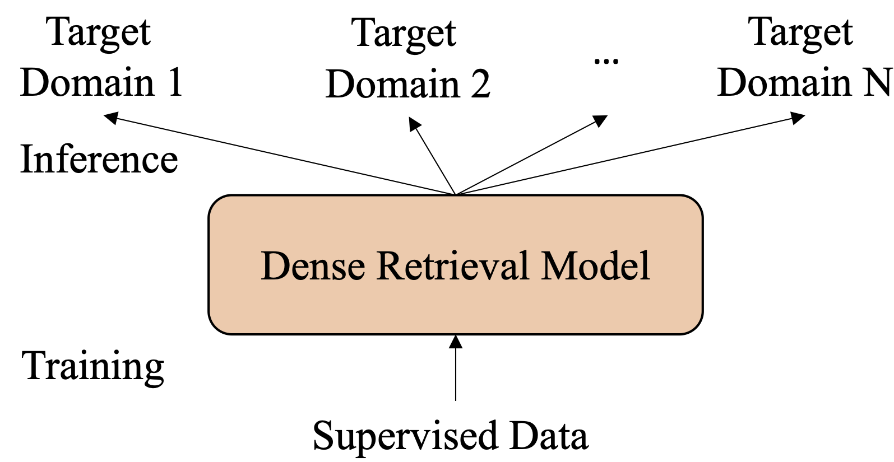
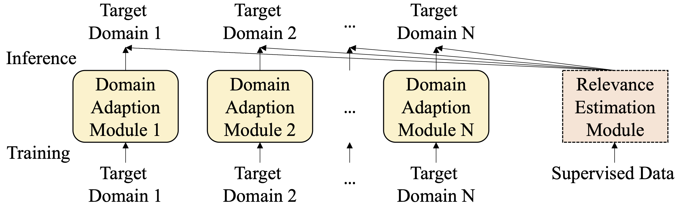

# Disentangled Dense Retrieval

<p align="left">
    <a href="https://github.com/jingtaozhan/disentangled-retriever">
    
    </a>
    <a href="https://github.com/jingtaozhan/disentangled-retriever/blob/main/LICENSE">
    
    </a>
    <a>
    <a href="https://pytorch.org">
    
    </a>
    <a>
    <a href="https://github.com/jingtaozhan/disentangled-retriever">
    
    </a>
    <a href="https://github.com/jingtaozhan/disentangled-retriever">
    </a>
</p>

This is the official repo for our paper [Disentangled Modeling of Domain and Relevance for Adaptable Dense Retrieval](https://arxiv.org/pdf/2208.05753.pdf). Disentangled Dense Retrieval (DDR) supports effective and flexible domain adaptation.

## Quick Links

- [Quick Tour](#quick-tour)
- [Installation](#installation)
- [Reproducing Results](#reproducing-results)
    - [Preparing Datasets](#preparing-datasets)
    - [Reproducing Results with Trained Checkpoints](#reproducing-results-with-trained-checkpoints)
    - [Generic Relevance Estimation: Training REM](#generic-relevance-estimation-training-rem)
    - [Unsupervised Domain Adaption: Training DAM](#unsupervised-domain-adaption-training-dam)
    - [Training Dense Retrieval Baselines](#training-dense-retrieval-baselines)
- [Application in Custom Datasets](#application-in-custom-datasets)  
    - [Learning Relevance with Supervision](#learning-relevance-with-supervision)
    - [Adapting to an Unseen Domain](#adapting-to-an-unseen-domain)
    

## Quick Tour

Common Dense Retrieval (DR) is vulnerable to domain shift: the trained DR models perform worse than traditional retrieval methods like BM25 in out-of-domain scenarios.

In this work, we propose **Disentangled Dense Retrieval (DDR)** to support effective and flexible domain adaptation. 
DDR consists of a Relevance Estimation Module (REM) for modeling domain-invariant matching patterns and several Domain Adaption Modules (DAMs) for modeling domain-specific features of multiple target corpora to mitigate domain shift. 
By making the REM and DAMs disentangled, DDR enables a flexible training paradigm in which REM is trained with supervision once and DAMs are trained with unsupervised data. 

Dense Retrieval   |  Disentangled Dense Retrieval
:-------------------------:|:-------------------------:
  |  

The idea of DDR can date back to classic retrieval models in the pre-dense-retrieval era. BM25 utilizes the same formula for estimating relevance scores across domains but measures word importance with corpus-specific IDF values. 
However, it does not exist in DR where the abilities of relevance estimation and domain modeling are jointly learned during training and entangled within the model parameters. 


Please check our [paper](https://arxiv.org/pdf/2208.05753.pdf) to see the amazing out-of-domain performance gains brought by the disentangled modeling!

## Installation

Three special dependencies should be installed manually: disentangled-retriever depends on [PyTorch](https://pytorch.org/get-started/locally/) and [Faiss](https://github.com/facebookresearch/faiss/blob/main/INSTALL.md), which require platform-specific custom configuration. They are not listed in the requirements and the installation is left to you. In our development, we run the following commands for installation.
```bash
# choose cudatoolkit version according to your environment
conda install pytorch torchvision torchaudio cudatoolkit=11.3 -c pytorch 
conda install -c conda-forge faiss-gpu
```
disentangled-retriever also depends on [adapter-transformers](https://github.com/adapter-hub/adapter-transformers). Since the library is still in development and api is unstable, run the following code to install a certain version (commit).
```bash
git clone git@github.com:adapter-hub/adapter-transformers.git
cd adapter-transformers
git checkout 74dd021
pip install .
```

After these, now you can install from our code: 
```bash
git clone https://github.com/jingtaozhan/disentangled-retriever
cd disentangled-retriever
pip install .
```
For development, use
```
pip install --editable .
```

## Reproducing Results

### Preparing datasets

We provide detailed instructions on how to prepare the training data and the out-of-domain test sets:

- [Preparing English training data and out-of-domain test sets](./examples/dense-mlm/english-marco/prepare_dataset/README.md)
- [Preparing Chinese training data and out-of-domain test sets](./examples/dense-mlm/chinese-dureader/prepare_dataset/README.md)

### Reproducing Results with Trained Checkpoints

We have provided commands for reproducing the various results in our [paper](https://arxiv.org/pdf/2208.05753.pdf).
- [Reproducing results of Disentangled Dense Retrieval on English out-of-domain datasets](./examples/dense-mlm/english-marco/inference.md)
    - On multiple datasets: TREC-Covid, Lotte-Writing, Lotte-Recreation, Lotte-Technology, Lotte-Lifestyle, and Lotte-Science.
    - Evaluting both contrastively trained and distilled models.
- [Reproducing results of Disentangled Dense Retrieval on Chinese out-of-domain datasets](./examples/dense-mlm/chinese-dureader/inference.md)
    - On multiple datasets: CPR-Ecom, CPR-Video, CPR-Medical, cMedQAv2.
    - Evaluting both contrastively trained and distilled models.
- [Reproducing results of Dense Retrieval baselines on English out-of-domain datasets](./examples/dense-mlm/english-marco/inference_baseline.md)
    - Evaluating self-implemented Dense Retrieval baselines that follow the same finetuning settings as Disentangled Dense Retrieval. 
    - Evaluating (a) strong Dense Retrieval model(s) in the literature.
- [Reproducing results of Dense Retrieval baselines on Chinese out-of-domain datasets](./examples/dense-mlm/chinese-dureader/inference_baseline.md)
    - Evaluating self-implemented Dense Retrieval baselines that follow the same finetuning settings as Disentangled Dense Retrieval. 

### Generic Relevance Estimation: Training REM 

Relevance Estimation Module (REM) is only required to trained once. In our paper, we use MS MARCO as English training data and use Dureader as Chinese training data. We also explore two finetuning methods. The commands are provided. You can also use your own supervised data to train a REM module. 

- [Training REM on MS MARCO](./examples/dense-mlm/english-marco/train_rem.md)
    - Disentangled Finetuning
    - Hard negatives, contrastive loss. or Cross-encoder scores, Margin-MSE loss.
- [Training REM on Dureader](./examples/dense-mlm/chinese-dureader/train_rem.md)
    - Disentangled Finetuning
    - Inbatch negatives, contrastive loss.

### Unsupervised Domain Adaption: Training DAM

With a ready REM module, Domain Adaption Module (DAM) is trained unsupervisedly for each target domain to mitigate domain shift. In the following, we give examples about how to adapt to an unseen English/Chinese domain. Note that we suppose the REM module is ready and directly load the trained REM module. 

- [Adapting to an unseen English domain](./examples/dense-mlm/english-marco/adapt_domain.md)
    - Unsupervised Adaption yet high effectiveness.
    - Take Lotte-Technology as an example.
- [Adapting to an unseen Chinese domain](./examples/dense-mlm/chinese-dureader/adapt_domain.md)
    - Unsupervised Adaption yet high effectiveness.
    - Take CPR-Ecommerce as an example.

### Training Dense Retrieval baselines

Here we provide commands for training Dense Retrieval baselines. In our codebase, we support training a Dense Retrieval model with exactly the same finetuning implememtation. Therefore, we can fairly compare the two paradigms. 

- [Training Dense Retrieval baselines on MS MARCO](./examples/dense-mlm/english-marco/train_baseline.md)
    - Hard negatives, contrastive loss.
    - Cross-encoder scores, Margin-MSE loss.
- [Training Dense Retrieval baselines on Dureader](./examples/dense-mlm/chinese-dureader/train_baseline.md)
    - In batch negatives, contrastive loss.


## Application in Custom Datasets

Here we introduce how to apply Disentangled Dense Retrieval in your custom datasets.

### Learning Relevance with Supervision

If you have your own labeled data, you may consider training a Relevance Estimation Module (REM) on it (You can also use our provided checkpoints for English/Chinese experiments as well). To directly use this codebase for training, you need to convert your dataformat as follows
- corpus.tsv: corpus file. each line is `docid doc' separated by tab.
- query.train: training queries. each line is `qid query' separated by tab.
- qrels.train: annotations. each line is `qid 0 docid rel_level' separated by tab. 
- [Optional] hard negative file for contrastive training: each line is `qid   neg_docid1 neg_docid2 ...'. qid and neg_docids are separated by tab. neg_docids are separated by space.
- [Optional] soft labels for knowledge distillation: a pickle file containing a dict: {qid: {docid: score}}. It should contain the soft labels of positive pairs and of several negative pairs.

If you still have questions about the data formatting, you can check [how we convert MS MARCO](./examples/dense-mlm/english-marco/prepare_dataset/README.md#ms-marco-passage-ranking).

With formatted supervised data, now you can train a REM module. We use a disentangled finetuning trick: first training a DAM module to capture domain-specific features and then training the REM module to learn domain-invariant matching patterns. You can find a training example [here](./examples/dense-mlm/english-marco/train_rem.md). After training, you will acquire a REM module that can will be directly used in any domain. 

### Adapting to an Unseen Domain

We suppose you already have a REM module (trained by yourself or provided by us). Now you need to adapt the model to an unseen domain. To do this, you need to train a Domain Adaption Module (DAM) that can mitigate the domain shift. 

Don't worry. The training is completely unsupervised and only requires the target-domain corpus. Each line of the corpus file should be formatted as `id doc' separated by tab. With it, you can train a DAM model. Please follow our example [here](./examples/dense-mlm/english-marco/adapt_domain.md).


## Citation
If you find our work useful, please consider citing us :)
```
@article{zhan2022disentangled,
  title={Disentangled Modeling of Domain and Relevance for Adaptable Dense Retrieval},
  author={Zhan, Jingtao and Ai, Qingyao and Liu, Yiqun and Mao, Jiaxin and Xie, Xiaohui and Zhang, Min and Ma, Shaoping},
  journal={arXiv preprint arXiv:2208.05753},
  year={2022}
}
```